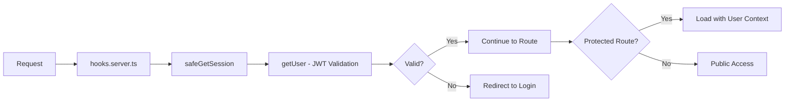
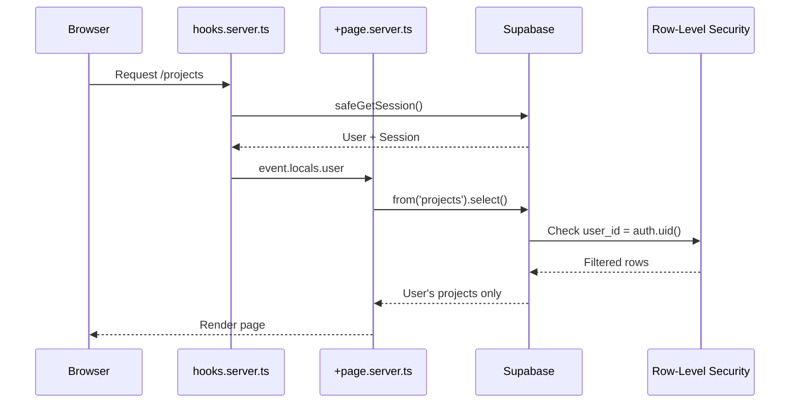
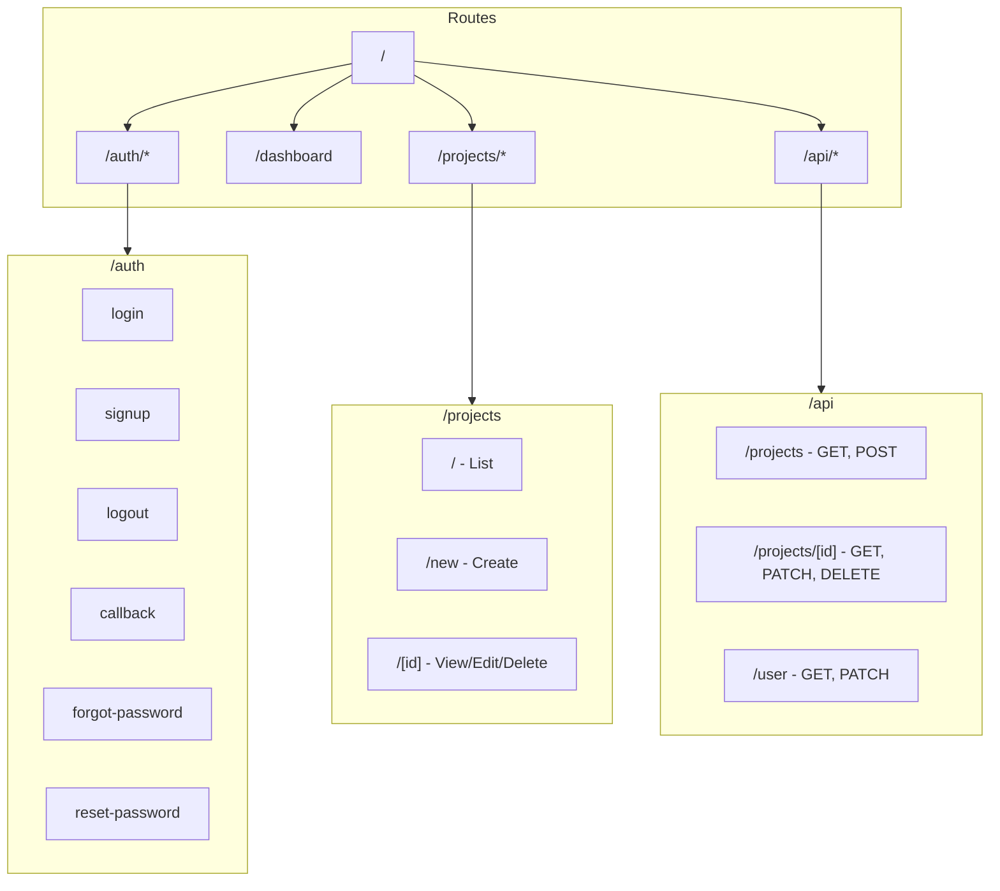
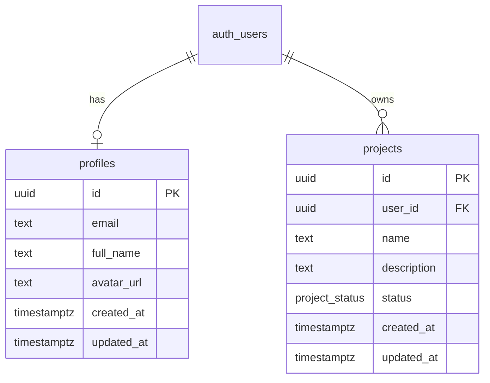

# SvelteKit + Supabase Production Starter

A production-ready SvelteKit application with Supabase authentication, Row-Level Security, and TypeScript.

**Built by [Zain ul Hassan](https://github.com/zainulhassan815)** to demonstrate modern full-stack architecture patterns.

## Tech Stack

- **Framework**: SvelteKit 2 with Svelte 5 (runes)
- **Language**: TypeScript (strict mode)
- **Database**: Supabase (PostgreSQL)
- **Auth**: Supabase Auth with SSR support
- **Styling**: Tailwind CSS 4

## Features

- User authentication (email/password)
- Password reset flow
- Projects CRUD with status management
- RESTful API endpoints
- Row-Level Security (RLS) policies
- Type-safe database operations
- Server-side form validation

## Architecture

### Authentication Flow



**Key Security Decision**: We use `safeGetSession()` which calls `getUser()` to validate JWTs server-side, rather than trusting the unvalidated session from `getSession()`.

### Request Lifecycle



### Row-Level Security

All tables have RLS enabled with optimized user-scoped policies:

```sql
-- Using subquery pattern for better performance
CREATE POLICY "Users can view their own projects"
    ON public.projects
    FOR SELECT
    USING ((select auth.uid()) = user_id);
```

### Project Structure



### File Structure

```
src/
├── app.d.ts                    # Global types (Supabase, Locals)
├── hooks.server.ts             # Auth middleware + route guards
├── lib/
│   ├── components/
│   │   └── OAuthButtons.svelte # Social auth buttons
│   ├── database.types.ts       # Generated Supabase types
│   └── supabase/
│       └── client.ts           # Browser client factory
└── routes/
    ├── +layout.server.ts       # SSR session loading
    ├── +layout.svelte          # Auth state listener
    ├── auth/
    │   ├── login/              # Email/password login
    │   ├── signup/             # Registration
    │   ├── callback/           # OAuth/magic link handler
    │   ├── logout/             # Server-side logout
    │   ├── forgot-password/    # Request password reset
    │   └── reset-password/     # Set new password
    ├── dashboard/              # User dashboard
    ├── projects/
    │   ├── +page.svelte        # List with filters
    │   ├── new/                # Create project
    │   └── [id]/               # View/edit/delete
    └── api/
        ├── projects/           # Projects REST API
        └── user/               # User profile API
```

### SSR/CSR Boundaries

| Concern                   | Server (SSR)       | Client (CSR)        |
| ------------------------- | ------------------ | ------------------- |
| Session validation        | `safeGetSession()` | -                   |
| Data fetching (protected) | `+page.server.ts`  | Via server load     |
| Auth state changes        | -                  | `onAuthStateChange` |
| Form submissions          | Form actions       | `use:enhance`       |

## Getting Started

### Prerequisites

- Node.js 20+
- Supabase CLI (for local development)
- A Supabase project ([create one free](https://supabase.com/dashboard))

### 1. Clone & Install

```bash
git clone <repo-url>
cd sveltekit-supabase-demo
npm install
```

### 2. Configure Environment

```bash
cp .env.example .env
```

Add your Supabase credentials:

```env
PUBLIC_SUPABASE_URL=https://your-project.supabase.co
PUBLIC_SUPABASE_PUBLISHABLE_KEY=your-anon-key
```

### 3. Local Development with Supabase

Start Supabase locally:

```bash
npx supabase start
```

Reset database and apply migrations:

```bash
npx supabase db reset
```

Generate TypeScript types:

```bash
npx supabase gen types typescript --local > src/lib/database.types.ts
```

### 4. Start Development Server

```bash
npm run dev
```

Open [http://localhost:5173](http://localhost:5173)

## Key Patterns Demonstrated

### 1. Type-Safe Database Access

```typescript
import type { Tables, TablesInsert } from '$lib/database.types';

// Insert with type safety
const insertData: TablesInsert<'projects'> = {
  user_id: user.id,
  name: 'My Project',
  status: 'draft'
};

const { data } = await supabase.from('projects').insert(insertData).select().single();
// data is typed as Tables<'projects'>
```

### 2. SvelteKit Form Actions

```typescript
// +page.server.ts
export const actions: Actions = {
  default: async ({ request, locals }) => {
    const formData = await request.formData();
    const name = formData.get('name') as string;

    if (!name?.trim()) {
      return fail(400, { error: 'Name is required', name });
    }

    const { error } = await locals.supabase
      .from('projects')
      .insert({ name, user_id: locals.user.id });

    if (error) {
      return fail(500, { error: 'Failed to create project' });
    }

    throw redirect(303, '/projects');
  }
};
```

### 3. Protected Route Pattern

```typescript
// hooks.server.ts
const protectedRoutes = ['/dashboard', '/projects'];
const isProtectedRoute = protectedRoutes.some((route) => event.url.pathname.startsWith(route));

if (isProtectedRoute && !session) {
  throw redirect(303, '/auth/login?redirectTo=' + event.url.pathname);
}
```

### 4. Svelte 5 Runes

```svelte
<script lang="ts">
  let { data } = $props();

  let email = $state('');
  let loading = $state(false);

  // Derived state
  let isValid = $derived(email.includes('@') && email.length > 5);

  // Effect for side effects
  $effect(() => {
    if (data.user) {
      console.log('User logged in:', data.user.email);
    }
  });
</script>
```

### 5. RESTful API Endpoints

```typescript
// +server.ts
export const GET: RequestHandler = async ({ locals }) => {
  const { user } = await locals.safeGetSession();

  if (!user) {
    return json({ error: 'Unauthorized' }, { status: 401 });
  }

  const { data, error } = await locals.supabase
    .from('projects')
    .select('*')
    .order('created_at', { ascending: false });

  return json({ projects: data });
};
```

## Database Schema



## Scripts

| Command           | Description               |
| ----------------- | ------------------------- |
| `npm run dev`     | Start development server  |
| `npm run build`   | Build for production      |
| `npm run preview` | Preview production build  |
| `npm run check`   | Run TypeScript checks     |
| `npm run format`  | Format code with Prettier |

## Production Checklist

- [ ] Enable email confirmation in Supabase Auth settings
- [ ] Configure OAuth providers (GitHub, Google)
- [ ] Configure allowed redirect URLs
- [ ] Set up proper CORS policies
- [ ] Add rate limiting for auth endpoints
- [ ] Implement proper error logging
- [ ] Add session refresh handling for long-lived sessions
- [ ] Deploy with appropriate adapter (Vercel, Node, etc.)

## Author

**Zain ul Hassan**

- GitHub: [zainulhassan815](https://github.com/zainulhassan815)
- LinkedIn: [Connect](https://linkedin.com/in/zainulhassan815)

---

_This project demonstrates production-ready patterns for SvelteKit + Supabase applications._
